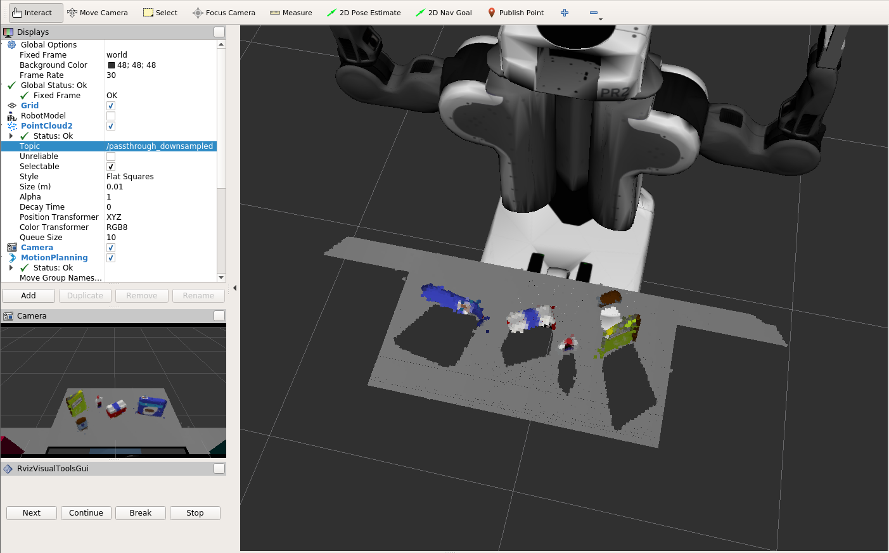

## Project: Perception Pick & Place

The mains steps in this perception Pipeline are presented in this ReadMe file.

---

### RGBD camera feed from ASUS Xtion

## 1. Pipeline for filtering and RANSAC plane fitting implemented.

### Statistical Outlier Filter

This is used to remove the points that do not satisfy the given criteria. In this, we set 2 things:

1. Number of neighbors to consider.  
2. The distance beyond which the point is considered an outlier.

### Vowel Grid Downsampling 

This is required to downsample the incoming data. This helps in processing the data that is feature rich.
Downsampling of data leads to more spatial date resolution.
This provides us with a sparsely sampled point data cloud thus reducing the processing power needed to analyze the incoming data.

### Pass Filtering ( Cropping )

Specifying an axis leads to cropping along that direction with the specified magnitude. I put a passthrough filter for the 

1. `x` axis to filter the surrounding bins.
2. `z` axis to filter the stand of the table

### Random Sample Consensus ( RANSAC )

RANSAC is used to cluster the points when :

1. The particular shape of the cluster is known.
2. Number of clusters is known.

We knew there is only 1(number) table present as well as that its planar(shape). Thus, RANSAC was used.

#### Objects are in the outlier of the RANSAC plane fitting model

## 2. Pipeline including clustering for segmentation implemented.  

### DBSCAN (Euclidean clustering)

Used when the number of clusters is unknown(This resembles the real life scenario where this is almost always true ). 
Given the radius `d` and number of points to consider `N`, it segments the points into points, thereby segmenting the camera RGBD feed to separate objects.

## 2.  Features extracted and SVM trained.  Object recognition implemented.

### Features To extracted

Good features extraction leads to better and robust object recognition.  

(cube) 		RGB = RG and b axis where a point represents the value of R, G and B in the point.  

(cylinder) 	HSV = Hue is the color(angular displacement), saturation is intensity of color(radial displacement) and value is the aural brightness (height).

Training with HSV leads to better results than RGB counterparts because it has low dependence on brightness levels.

#### color histogram (uses color information as feature)

1. Divide the range of values into different bins.
2. Put the incoming values into their respective bins.
3. Normalizing can help to match objects with different size.
4. Compare the obtained color distribution with object to be found.

#### Surface normals (uses shape information as feature)
Just like color histograms, here, shape histograms are made. In each bar(bin), the surface normals of same direction are placed.
Sphere has a uniform constant surface normal distribution.

The histogram code can be found in the file [features.py](sensor_stick/src/sensor_stick/features.py).

### Support Vector Machine (SVM)
Features are stored as normalized histogram (unit variance and zero mean) and given to the SVM for training.

1. Given features and labels of data points, it is trained and computes a decision boundary.
2. Uses the decision boundary to predict the new label of new data points.

  
### Steps taken to use the SVM:

1. Read the input images.
2. `Extract` the color (feature) vector.
3. Normalize the vector to `zero mean` and `unit variance`.
4. Define a label vector.
5. Shuffle and split the data into `training` and `testing` sets.
6. Define the classifier.
7. Train the classifier.

##### Specifications

| Name 		|  Value 		|
   ---		|	---			
|Iterations	| 99			|
|Bins 	   	| 32 			|
|accuracy	| 90% (approx) 	|

#### Objects Detection

  

The trained SVM model classifies the captures point out into an object. The accuracy of the model depends on the quality and number of object data samples the SVM was trained on. The `output_*.yaml` files for `test\*.world` can be found under `pr2_robot/scripts/`. Only the `glue` was not getting detected in `test3.world` because a `book` was in front of it. On deleting the book in front, the glue was successfully detected. The output file of this scenario is labeled `output_3_glue_detected.yaml`.  

### Conclusion:

#### Future Work

This project can be improvised by incorporating the pick and place operations. This will also improve the object recognition because some of the objects are _behind_ others, like in `test3.world`, `glue` is behind the `book` if the `book` is picked up and placed(elsewhere or in the dropbox), the glue will be easily detected as evident from the [output_3_glue_detected.yaml](pr2_robot/scripts/output_3_glue_detected.yaml). 

Also, *collision detection* is an important aspect for the _efficient and safe manipulations_ by the robot.

#### Fails

This project might fail if:

1. Number of tables unknown; RANSAC needs to know the number of cluster to be effective.
2. If not trained for an object point cloud; this can be improved by training the SVM on the dataset of lots of real world objects' point cloud.
3. Passthrough filters need to be changed for different scenarios to best filter to analyze only the objects of value.

